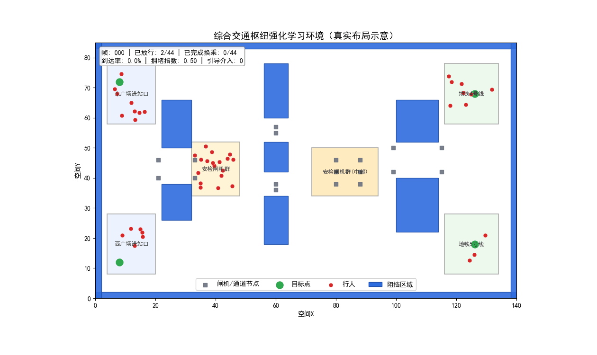
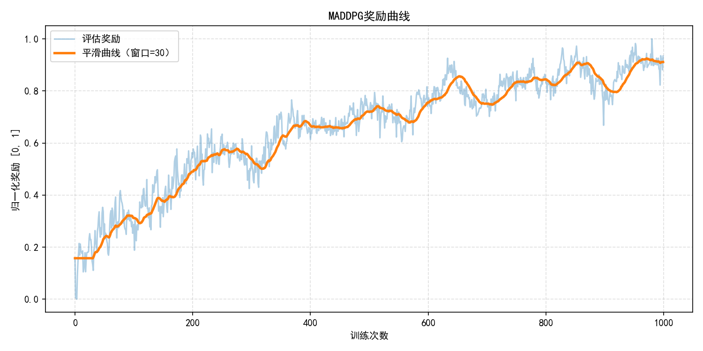
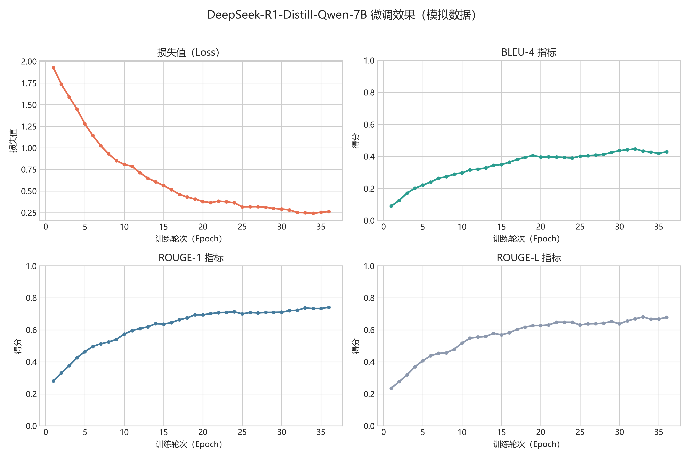

# 智枢星（ZhiShuXing）

综合交通枢纽智慧换乘引导项目，聚焦“动态客流 + 多智能体协同 + 可视化交互”。

本仓库集成了以下能力：

- 基于 Unity ML-Agents 环境的 MADDPG 训练与评估
- 面向换乘场景的数据生成、结果分析与可视化
- Web 交互界面与流式应用原型（Flask / Streamlit）
- 预置模拟结果文件，支持快速复现实验图表

## 项目亮点

- 面向真实场景：围绕综合交通枢纽换乘效率提升设计指标与流程
- 端到端链路：覆盖训练、评估、可视化、交互展示
- 多形态输出：支持奖励曲线、换乘时间分布、场景对比等成果图

## 仓库结构

```text
.
├─ program/                          # 核心代码与实验脚本
│  ├─ MADDPG/                        # 训练、环境封装、Web 服务、智枢星模块
│  │  ├─ MADDPG_main.py              # MADDPG 主训练入口（Unity ML-Agents）
│  │  ├─ run_zhishuxing_demo.py      # 智枢星演示脚本
│  │  ├─ run_zhishuxing_web.py       # Flask Web 服务入口
│  │  ├─ webapp/                     # Web 控制台
│  │  └─ zhishuxing/                 # 导航、系统、可视化模块
│  ├─ fine/                          # 微调与场景对比分析脚本
│  ├─ data_train/                    # 训练与模拟输出数据
│  └─ requirements.txt               # Python 依赖
├─ UI/                               # 交互界面素材与 Streamlit 原型
├─ ml-agents-develop/                # ML-Agents 开发版本代码镜像
└─ ml-agents-release_18_branch/      # ML-Agents release_18 分支代码镜像
```

## 快速开始

### 1. 环境准备

建议 Python 3.11+。

```bash
cd program
pip install -r requirements.txt
```

如果需要运行 UI 目录下的 Streamlit 原型，可额外安装：

```bash
pip install streamlit openai requests
```

### 2. 运行智枢星演示

```bash
cd program
python MADDPG/run_zhishuxing_demo.py --output_dir data_train
```

运行后会在 data_train 中生成汇总与可视化结果（如 zhishuxing_summary.json）。

### 3. 启动 Web 控制台（Flask）

```bash
cd program
python MADDPG/run_zhishuxing_web.py --host 0.0.0.0 --port 7860
```

浏览器访问：`http://127.0.0.1:7860`

### 4. 启动 MADDPG 训练（连接 Unity）

```bash
cd program
python MADDPG/MADDPG_main.py \
	--mlagents_file "D:\\Builds\\HubTransfer\\HubTransfer.exe" \
	--behavior_name "HubAgent" \
	--base_port 5005 \
	--episode_limit 200 \
	--max_train_steps 500000 \
	--evaluate_freq 5000
```

说明：

- 若连接 Unity Editor，可将 --mlagents_file 留空（默认 None）
- behavior_name 为空时，将自动选取第一个 Behavior

## 结果分析与可视化

在 program 目录下可运行：

```bash
# 奖励曲线
python MADDPG/plot_results.py --data_dir ./data_train

# 换乘时间分布（可生成模拟 CSV 与图）
python MADDPG/plot_transfer_time_distribution.py

# 训练前后不同场景效率对比
python fine/compare_transfer_efficiency_scenarios.py

# 微调指标可视化（模拟）
python fine/plot_finetune_metrics.py
```

## 展示素材

仓库已包含部分展示素材，可用于项目汇报与 GitHub 展示：

- AR 动态效果：picture/transfer_env_demo.gif
- 奖励曲线：picture/reward_curve.png
- 微调指标图：picture/finetune_metrics_simulated.png

### 预览







## 依赖与兼容性

主要依赖（见 program/requirements.txt）：

- torch
- torchvision
- gym
- mlagents-envs
- numpy
- matplotlib
- flask
- waitress

## 注意事项

- 请勿将真实 API Key、模型密钥提交到公开仓库
- 训练依赖 Unity 场景配置与通信端口，建议先用小步数验证链路
- Windows 路径中如包含空格或中文，请使用引号包裹命令参数

## 许可与使用

本仓库当前未在根目录声明统一开源许可证。若计划公开发布，建议补充 LICENSE 文件并明确第三方代码（如 ML-Agents 镜像）的许可边界。