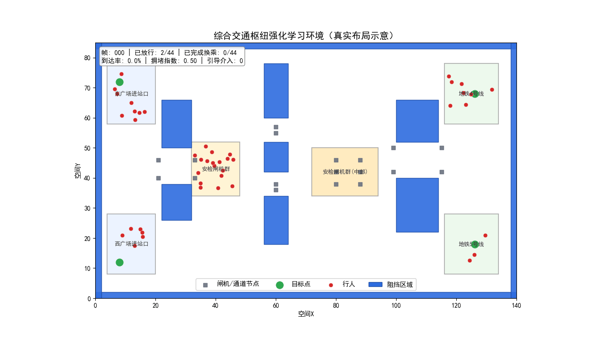
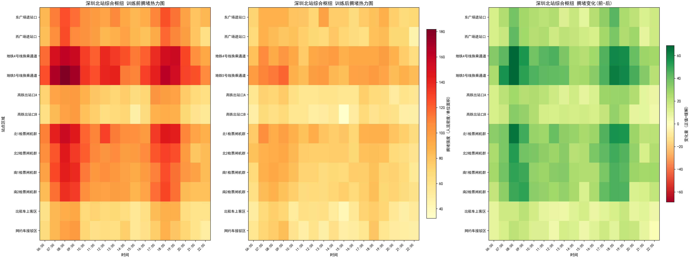
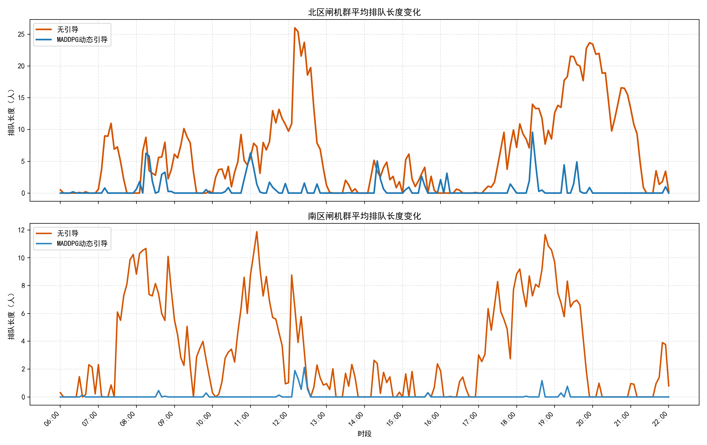

# 智枢星（ZhiShuXing）v2

动态客流下的综合性交通枢纽智慧换乘引导系统：**MADDPG 多智能体强化学习 + 枢纽仿真 + LLM 引导 + Web/移动端**。

## 功能总览

- **多智能体强化学习**：MADDPG / MATD3 双算法（Unity ML-Agents 环境），训练产物（评估奖励 npy、actor 权重）可被 Web/CLI 直接加载推理
- **智慧换乘引导**：A* 路径规划（支持“必经安检”）、动态客流热力、MADDPG（或启发式回退）驱动的多智能体引导仿真
- **真实路线规划**：LLM 提取出行诉求 → 高德地理编码/公交换乘（偏好参数真实生效），内置枢纽引擎（A* + RL 仿真）可离线运行
- **地图展示双通道**：规划结果优先渲染**高德 JS API 真实底图**（折线沿真实道路、起终点标注、深色地图风格），未配置 Key 或加载失败时自动回退 Canvas 折线示意并注明原因
- **分析报告**：奖励曲线、深圳北站拥堵热力图、P50/P90/Max 换乘时间、安检排队对比、场景效率对比、微调指标、行人动图——固定种子可复现
- **Web 控制台 + 移动端 PWA**：同一后端（Flask）服务，PWA 可安装、离线缓存、后端不可用时自动回退演示数据

## 仓库结构

```text
.
├─ configs/                 # 导航图 / 演示场景 / 训练超参 / 微调样例数据
├─ src/zhishuxing/          # 核心 Python 包
│  ├─ config.py             # 路径与密钥（环境变量，零硬编码）
│  ├─ cli.py                # 统一入口 demo/train/analyze/simulate/animate/serve/smoke
│  ├─ core/                 # 导航A*、场景、客流、引导仿真、行人动图、系统编排
│  ├─ rl/                   # networks、agents(MADDPG+MATD3)、buffer、Unity环境、训练Runner、运行时
│  ├─ llm/                  # LLM 适配器（Mock + SiliconFlow 真实实现）
│  ├─ planning/             # 高德真实路线规划（OD提取/编码/换乘/详情）
│  ├─ analysis/             # 绘图/IO工具、合成数据生成器、7类分析报告
│  └─ webapp/               # Flask 应用工厂、服务层、前端
├─ web/mobile/              # 移动端 PWA（可安装、ServiceWorker 缓存）
├─ unity/                   # Unity 侧智能体模板 HubTransferAgent.cs
├─ tests/                   # pytest 测试套件（46 项）
├─ data/samples/            # 参考产物（README 展示图、奖励 npy 等）
├─ data/outputs|model|runs/ # 运行时输出（gitignore）
├─ code_optimization/       # 性能优化基准与报告（行人仿真 step 19x 加速）
├─ docs/architecture.md     # 架构说明与迁移映射
└─ legacy/ui/               # 历史 Streamlit 原型归档（密钥已移除）
```

## 快速开始

```bash
pip install -e .            # 基础依赖；训练链路: pip install -e .[train]
zhishuxing demo             # 一键演示 → data/outputs/zhishuxing_dashboard.png + summary
zhishuxing analyze --report all   # 全部 7 类分析报告
zhishuxing simulate         # MADDPG（无权重时启发式回退）引导仿真
zhishuxing serve --port 7860      # Web 控制台 http://127.0.0.1:7860
                                  # 移动端 PWA   http://127.0.0.1:7860/mobile
pytest                      # 运行测试套件
```

### 环境变量（密钥，绝无默认值）

| 变量 | 用途 |
|---|---|
| `SILICONFLOW_API_KEY` | LLM 引导文案 / OD 提取（OpenAI 兼容） |
| `AMAP_REST_KEY` / `AMAP_JS_KEY` | 高德真实路线规划 / 地图 JS 底图 |
| `AMAP_SECURITY_CODE` | 高德 JS API 安全密钥（2021-12 后申请的 Key 必填） |
| `ZHISHUXING_WORKSPACE` | 工作区根目录覆盖（默认自动推导） |

> 历史版本曾将密钥硬编码在 `UI/config_direct.py` 并已进入 git 历史，**请务必到平台作废重发**。

### MADDPG 训练（连接 Unity）

```bash
zhishuxing train \
  --mlagents_file "D:\\Builds\\HubTransfer\\HubTransfer.exe" \
  --behavior_name HubAgent \
  --episode_limit 200 --max_train_steps 500000 --evaluate_freq 5000
# 留空 --mlagents_file 连接 Unity Editor；--algorithm MATD3 启用 TD3 变体
```

训练产物：`data/outputs/MADDPG_env_*.npy`（评估奖励）、`data/model/integrated_hub_transfer/*_actor_*_agent_*.pth`（权重）。
训练完成后在 Web 控制台点击“加载最新策略权重”，即可用真实策略执行引导仿真。

## Web API 一览

| 端点 | 说明 |
|---|---|
| `GET /health` | 健康检查 |
| `POST /api/navigation/load` / `POST /api/navigation/plan` | 导航图加载 / A* 规划（支持必经地标） |
| `GET /api/rl/status` | MADDPG 训练产物扫描与策略状态 |
| `POST /api/rl/load_policy` | 加载每个 agent 最新 step 的 actor 权重 |
| `POST /api/rl/act` | 观测→动作推理（观测语义与 Unity 模板对齐） |
| `GET /api/rl/rewards` | 训练评估奖励曲线 |
| `POST /api/rl/simulate` | 多智能体引导仿真（换乘步数/拥堵/轨迹图） |
| `POST /api/llm/load` / `fine_tune` / `simulate_metrics` | LLM 加载（Mock/真实）/ 微调 / 指标报告 |
| `POST /api/dashboard/run` | 客流热力 + 引导路径面板 |
| `POST /api/plan` | 真实路线规划（engine=amap 高德 / engine=hub 枢纽内） |
| `POST /api/features/run_existing` | 运行全部 7 类分析报告（结构化结果） |
| `GET /mobile` | 移动端 PWA |

## 成果预览





## 注意事项

- 训练需 Unity 场景（Behavior 名 `HubAgent`、连续动作），建议先用小步数验证链路；`mlagents-envs` 需从源码安装（见 `requirements.txt` 注释与 `docs/architecture.md`）
- `data/outputs` 中的分析图基于固定种子合成数据，保证可复现；接入真实训练数据后同一脚本直接出图
- 本仓库未声明统一开源许可证；ML-Agents 镜像（`third_party/`，不入库）遵循其原许可
